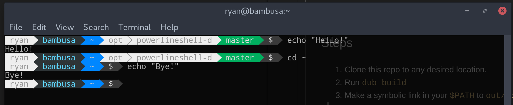

# Powerlineshell-d
### A powerlineshell implementation in D.



# Installation

## Requirements

* DUB and a D compiler (DMD or LDC).
* (Optional) If the glyphs are desired, the **patched fonts**. See the [original project](https://github.com/banga/powerline-shell) for instructions on installation.

## Steps

1. Clone this repo to any desired location.
2. Run `dub build`
3. Make a symbolic link in your `$PATH` to `out/app`
4. Add this to your `.bashrc`:

```
function _update_ps1() {
        PS1="$(<link to out/app>)"
}
if [ "$TERM" != "linux" ]; then
    PROMPT_COMMAND="_update_ps1; $PROMPT_COMMAND"
fi
```

And replace `<link to out/app>` with the path to the link.

# Configuration

`config.json` contains all the settings, including text colors. For the changes to take effect, you must save any changes and rebuild the project via `dub build`.

# Extending

The  `segments` array is the array of segments that are displayed on the prompt. The `segment` template is passed the instance of `Segment` that the user can interact with. To add a new segment, you must add it to the `segments` array. The prompt is evaluated in the order that the segments appear in the array.

```d
segment!((out Segment s) { 
    s.fg = config["fg_1"].integer;
    s.bg = config["bg_1"].integer;
    return `\u`;
})
```

In the above, the template `segment` takes one parameter, a delegate `action` of type `string function(out Segment)`. `action` is passed an instance of `segment`, `s`. Through this instance, the foreground and background colors are set through a config file. The integers must be valid ANSI color codes, a reference of which is generated when `color_reference.sh` is run. Any logic of the segment is placed in in the delegate body. The returned string is the text that is printed in the segment.

# Why?

Powerline shell relies on the Python VM to run. As a result it's slower than an executable binary. I found D to be a compromise between the ease of coding of Python and the speed of a compiled language.

# To-do

* Run each segment in its own thread for faster execution.
* Finish implementing Git integration.
